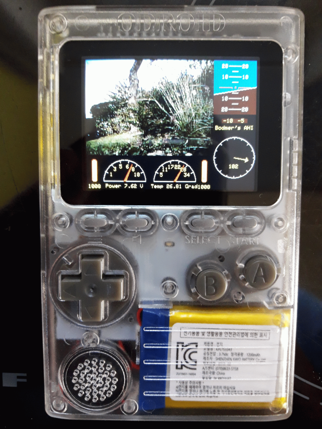
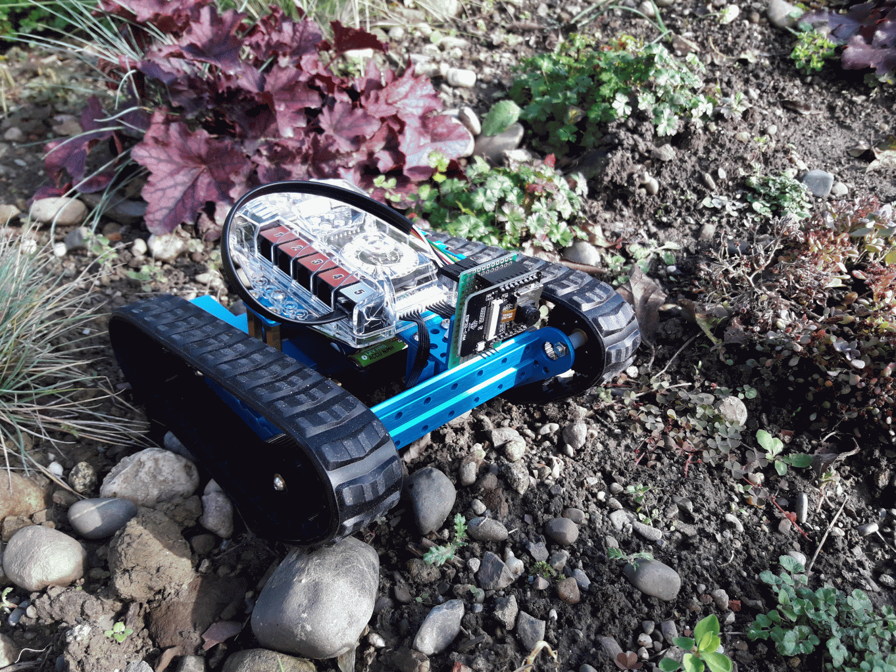

## MakeblockOdroidGoCam
   **Video remote control of a MakeBlock Auriga Ranger with an Odroid GO.**

   

   

   

### Description
   The goal was to control the Makeblock Auriga ranger with an Odroid GO.
   

### Disclaimer
   I don't take any responsibility nor liability for using this software nor for the 
   installation or any tips, advice, videos, etc. given by any member of this site or any related site.

### License
   This program is licensed under GPL-3.0

### Libraries
   * Library for the ESP32-Cam  
     https://github.com/espressif/arduino-esp32 
   * Makeblock library with ESP32-Cam sample.  
     https://github.com/Makeblock-official/Makeblock-Libraries
   * Odroid GO library  
     https://github.com/hardkernel/ODROID-GO

### Prerequisites
   * Arduino IDE with ESP32 libraries

### Shopping list
Here are some sample shopping items. Please check the details if everything is correct.

|Label              |Price |Sample URL        |
|-------------------|------|------------------|
|Odroid GO          |50€   | https://www.amazon.de/ODROID-GO-Spielekonsole-Einplatinencomputer-Mikrocontroller-Entwicklungsboard/dp/B07MZ7YCLD/ref=sr_1_1 |
|ESP32-CAM          |12€   | https://www.amazon.de/KeeYees-Bluetooth-ESP32-CAM-Entwicklungsboard-Kartenentwicklung/dp/B07RWJGF6S/ref=sr_1_4 |
|Makeblock Ranger   |150€  | https://www.amazon.de/Makeblock-Programmierbarer-Roboterbausatz-Bluetooth-Mint-Bildung/dp/B07KG4JHBH/ref=sr_1_1_sspa |

### Thanks
   * https://www.arduino.cc  
     *Thanks to the Arduino community with all its incredible possibilities and support.*
   * https://www.arduinoforum.de/arduino-Thread-Odroid-Go-ESP32?page=3  
     *Thanks to the nice idea from amithlon to show the ESP32-Cam on an Odroid GO*
